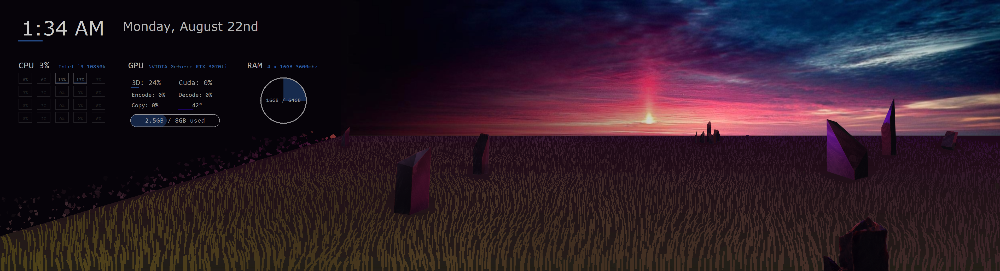

# wallpaperController
A custom interactive windows wallpaper I made

This program was built for my setup:
- 2 1920 by 1080 monitors
- i9 10850
- 3070ti
- 64gb 3600mhz ddr4

If you really want to you can probably mod this to work on your hardware and displays
